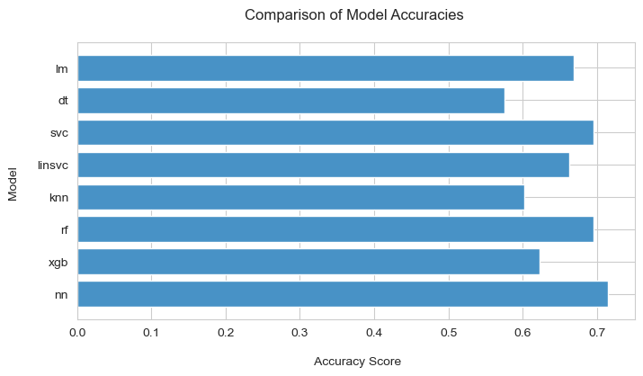
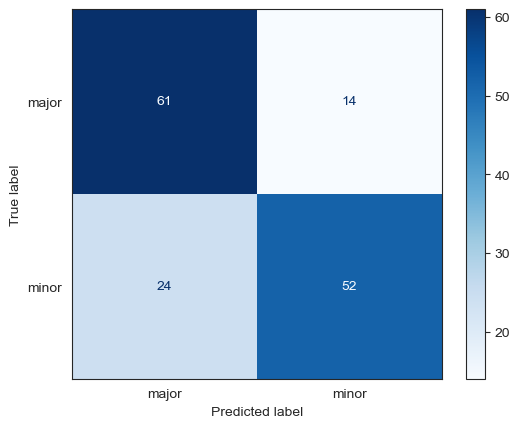

# Insurance Customer Affiliation through Vehicle Incident Severity Prediction

## Description
This project aims to develop a machine learning model capable of predicting the severity of vehicle claim incidents based on a variety of factors, including policy information, customer demographics and incident details.

## Table of Contents
- [Installation](#installation)
- [Data](#data)
- [Methodology](#methodology)
- [Results](#results)
- [Acknowledgments](#acknowledgments)

## Installation
### Prerequisites:
- Python 3.11.7

### Python packages used: 
- Data manipulation: numpy, pandas
- Data visualisation: matplotlib, seaborn
- Machine learning: imblearn, sklearn, xgboost

## Data
### Dataset Description
This dataset consists of motor vehicle claims made between 01 January 2015 and 01 March 2015 and contains 1000 observations and 39 features covering:
- Policy details
- Policyholder demographic information
- Incident details

### Data Acquisition
The data is sourced from the American market and is provided by Explore Data Science Academy.

### Data Preprocessing
- Data cleaning:
  - Removed outliers and obviously incorrect entries
  - Imputed missing values
  - Replaced '?' with 'unknown'
  - Standardized text case
- Feature engineering:
  - Converted incident severity to a binary label ('major' and 'minor') based on the limited size of the dataset
  - Removed high cardinality features (policy_number, insured_zip)
  - Removed fraudulent claims as these observations distort the model training
  - Removed features which would be unavailable at the time of claim submission (fraud_reported, total_claim_amount)
  - Converted claim value subsets into categorical features
  - Extracted year, month, week, day and weekday from datetime features
  - Created features identifying week period and day period
  - Adjusted policy features: extracted contract years from contract months, split policy CSL into individual bodily injury and property damage features, calculated total premiums paid, and created a binary feature for whether the client has an umbrella limit
  - Extracted road type from incident location
  - Ordinally encoded the customer's level of education
  - Extracted vehicle body shape from the vehicle make and model
  - Applied dummy variable encoding to categorical features
- Train-test-split:
  - The dataset was split into train and test sets with a test size of 20%.
- Class balancing:
  - Upsampled the 'major' incident severity class using synthetic minority oversampling technique (SMOTE)

## Methodology
We trained several machine learning classifiers to predict incident severity using the complete feature set. The top three performing models, determined by accuracy, were:
- Neural Network
- Random Forest
- Support Vector Machine

These models were further analyzed through classification reports. The feature space was reduced using feature importance and backward sequential feature selection for the top 20 features, and model hyperparameters were tuned using GridSearchCV.

## Results
The top performing model is the Random Forest, achieving an F1-score of 0.75 on the testing set.

While this model demonstrated better recall for the major than minor class, our priority for this project was to accurately predict major incidents to facilitate better resource allocation to these claims. As such, the Random Forest best meets our objectives.

## Acknowledgments
Thanks to Explore Data Science Academy (EDSA) for providing the dataset and the opportunity to work on this project as the final integrated project.
